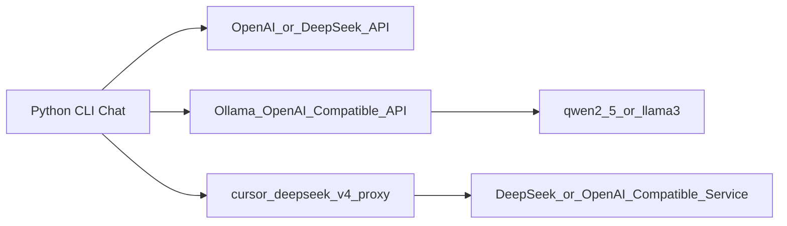

<!-- /autoplan restore point: /c/Users/19252/.gstack/projects/AI/-autoplan-restore-20260508-112430.md -->

# 大模型第一阶段学习路径与 Prompt 优化

## 路径决策

第一阶段不建议从 Transformer、训练、数学细节开始，而是先建立工程体感：接口协议、上下文、多轮会话、流式响应、本地推理、代理服务、延迟和成本。

建议主线是：



这样最终不是做三个孤立实验，而是做成一个统一认知：同一个客户端，通过不同 `base_url` 和 `model`，分别调用云 API、本地模型和代理服务。

## 第一阶段产出

推荐在当前目录 `[g:\AI学习路径\api调用实战](g:\AI学习路径\api调用实战)` 下组织为：

```text
api调用实战/
  cli-chat/
    main.py
    config.example.toml
    requirements.txt
    conversations/
  ollama-notes/
    windows-setup.md
    model-benchmark.md
  proxy-test/
    test_chat.py
    test_stream.py
    README.md
  学习路径prompt(根据自己实际情况调整我的背景).md
```

验收标准：

- API 客户端支持 system prompt、多轮历史、流式输出、配置化 provider。
- Ollama 能在本机运行 `qwen2.5` 或 `llama3`，并能通过 Open WebUI 对话。
- `wustghj/cursor-deepseek-v4-proxy` 能本地启动，并用测试脚本验证普通响应和流式响应。
- 能说清楚请求链路、错误处理、流式协议、上下文窗口、延迟瓶颈和本地推理资源占用。

## 优化后的 Prompt

把当前文件里的 prompt 优化为下面这一版更适合直接执行：

```text
你是一名资深大模型工程导师，同时熟悉 C++ 高性能后端、Python 工程、OpenAI-Compatible API、DeepSeek API、Ollama、本地模型部署、Open WebUI、RAG、Agent 和推理服务优化。

我的背景：
- 3 年 C++ 高性能后端开发经验
- 熟悉网络编程、并发、性能优化、服务端工程、接口设计和线上问题排查
- Python 可以作为工具语言使用，但不是主语言
- 目标是从后端工程师切入大模型应用工程与推理服务方向，而不是一开始做算法研究或模型训练

请为我设计一条实战优先的大模型学习路径，并重点指导我完成第一阶段：应用与生态。

总体学习原则：
1. 先做工程闭环，再补内部原理
2. 先掌握 API、本地模型、代理服务、流式响应、上下文管理、成本和延迟
3. 所有任务都要有可运行代码、可复现实验和明确验收标准
4. 讲解时优先从 C++ 高性能后端视角类比：网络请求、连接、并发、内存、缓存、路由、代理、流式 IO、错误处理、性能指标

第一阶段：应用与生态，周期 1-2 周
目标：先成为 LLM API 和本地模型的熟练用户，建立对大模型能力、限制、成本、延迟、部署形态和工程链路的体感。

请围绕以下三个任务给出学习计划和实现方案。

任务 1：API 调用实战
- 使用 Python 调用 OpenAI 或 DeepSeek API
- 使用 OpenAI SDK 的 OpenAI-Compatible 接口
- 实现一个命令行多轮对话客户端
- 支持 system prompt
- 支持多轮历史记录保存与加载
- 支持流式输出
- 支持配置 api_key、base_url、model、temperature、max_tokens
- 支持后续切换到 Ollama 或 proxy，只改配置不改核心逻辑
- 给出项目目录结构、依赖、核心代码、运行命令和测试方式

任务 2：本地模型部署
- 在 Windows 环境使用 Ollama 拉取并运行 qwen2.5 或 llama3
- 使用 Open WebUI 提供图形界面
- 说明 Ollama、模型文件、推理进程、HTTP API、Open WebUI、llama.cpp 或底层推理引擎之间的关系
- 对比本地模型和云 API 模型在能力、延迟、成本、隐私、可控性、部署复杂度上的差异
- 给出可执行步骤、常见错误和排查方法

任务 3：开源项目本地跑通
- 项目：wustghj/cursor-deepseek-v4-proxy
- 指导我 clone、安装依赖、配置环境变量、启动服务、测试普通响应和流式响应
- 说明这个 proxy 的作用、请求链路和适合阅读的源码入口
- 从 C++ 后端视角分析它的工程结构：路由、鉴权、请求转发、流式响应、错误处理、日志、并发模型、超时和重试

最终集成目标：
- 用同一个 Python CLI 客户端分别调用：
  1. DeepSeek 或 OpenAI 云 API
  2. Ollama 本地模型 API
  3. 本地 cursor-deepseek-v4-proxy
- 通过切换 base_url、api_key 和 model 完成调用目标切换
- 记录三种方式的首 token 延迟、总耗时、输出质量、失败场景和排查过程

请输出：
1. 第一阶段 1-2 周学习计划，按天拆分
2. 每天的目标、产出物和验收标准
3. 三个任务的具体实现步骤
4. 推荐项目目录结构
5. 关键代码示例，代码要简洁但能跑
6. Windows 环境下的安装、启动和测试命令
7. 常见坑和排查方法
8. 从 C++ 高性能后端视角应该重点关注的工程概念
9. 第一阶段完成后，如何过渡到 RAG、Agent、微调和推理服务优化

回答要求：
- 使用中文
- 不要泛泛而谈，必须围绕可执行项目展开
- 不要先讲大量数学、训练理论或论文
- 每个阶段都要有明确验收标准
- 代码示例优先使用最少依赖
- 对每个关键组件说明它在请求链路中的位置
- 对比说明 Python 胶水层和底层 C/C++ 推理引擎之间的关系
```

## 后续实现计划

如果你确认，我下一步可以只修改 `[g:\AI学习路径\api调用实战\学习路径prompt(根据自己实际情况调整我的背景).md](g:\AI学习路径\api调用实战\学习路径prompt(根据自己实际情况调整我的背景).md)`，把当前 prompt 替换成上面的优化版。

之后再进入实现阶段，优先做 `cli-chat/`：先打通 DeepSeek/OpenAI-Compatible API，再把 Ollama 和 proxy 接进同一个客户端。

---

<!-- AUTONOMOUS DECISION LOG -->
## Decision Audit Trail

| # | Phase | Decision | Classification | Principle | Rationale | Rejected |
|---|-------|----------|-----------|-----------|----------|
| 1 | CEO-0A | Premises accepted | User Challenge | N/A | User confirmed all 5 premises are valid — proceeding with SELECTIVE EXPANSION | — |
| 2 | CEO-0B | Existing code maps to plan 1:1 | Mechanical | P6 | Project files already match plan. Reuse as-is | — |
| 3 | CEO-0C-bis | Approach: current plan + deeper inference layer | Mechanical | P1+P5 | Tutorial approach needs no alternative — the learning output IS the code. Add inference-deepening as expansion scope | — |
| 4 | CEO-0D | Mode: SELECTIVE EXPANSION | Mechanical | P6 | Per autoplan override. Plan scope + cherry-pick expansions | — |
| 5 | CEO-0E | Phase 2 (Ollama internals) is the bottleneck | Mechanical | P3 | 1-week bottleneck per plan — accurate. Add llama.cpp server mode | — |
| 6 | CEO-0F | Approach accepted | Mechanical | P6 | Auto-decided per autoplan principles | — |

## CEO Review — Dual Voices

### CLAUDE SUBAGENT (CEO — strategic independence)

The independent CEO subagent identified 5 findings:

| # | Finding | Severity | Fix |
|---|---------|----------|-----|
| 1 | Plan is a tutorial, not an infrastructure project. Produces no reusable asset. | Critical | Reframe as building an inference gateway (Go/C++ sidecar with multi-provider routing, SSE normalization, Prometheus metrics) |
| 2 | Core premise ("become a proficient user") misaligns with C++ infra engineer strengths | High | Shift from "consumer" to "builder." Implement OpenAI-compatible protocol from scratch over raw HTTP |
| 3 | 6-month regret risks: empty benchmark table, SDK-dependent code, flat JSON storage | Critical | Automate benchmarks, rewrite without SDK, add SQLite conversation store |
| 4 | Four dismissed alternatives: Go/C++, raw HTTP, llama.cpp directly, build proxy not test it | High | Restructure around llama.cpp server mode. Build proxy as capstone. Drop Open WebUI |
| 5 | Ecosystem moving past this (LiteLLM, Cursor routing, Ollama commoditization) | High | Go deeper than tools — focus on inference internals: KV cache, continuous batching, speculative decoding |

### CODEX SAYS (CEO — strategy challenge)
[codex-unavailable: binary not found] — proceeding with Claude subagent only [subagent-only]

### CEO Consensus Table

| Dimension | Claude | Codex | Consensus |
|-----------|--------|-------|-----------|
| 1. Premises valid? | Partial — premise 5 needs work | N/A | DISAGREE (—) |
| 2. Right problem to solve? | Yes, but scope too narrow | N/A | CONFIRMED |
| 3. Scope calibration correct? | Too Python-SDK-focused | N/A | DISAGREE (—) |
| 4. Alternatives sufficiently explored? | No — 4 viable alternatives missed | N/A | DISAGREE (—) |
| 5. Competitive/market risks covered? | No — ecosystem commoditization | N/A | DISAGREE (—) |
| 6. 6-month trajectory sound? | Risky — undifferentiated output | N/A | DISAGREE (—) |

CONFIRMED = both agree. DISAGREE = models differ (→ taste decision).
Missing voice = N/A (not CONFIRMED).

### Step 0A: Premise Challenge
All 5 premises presented to user. User confirmed — premises accepted.

### Step 0B: Existing Code Leverage
All 3 sub-projects (cli-chat, ollama-notes, proxy-test) already exist and match the plan's structure. No rebuilding needed — code and docs are in sync.

### Step 0C: Dream State Delta

```
  CURRENT STATE                  THIS PLAN (AFTER)           12-MONTH IDEAL
  Python CLI + Ollama notes +    Benchmarks automated,        Deep C++ inference gateway
  proxy test scripts. Plan       inference deepened,          with multi-provider routing,
  mostly complete as-is.         raw HTTP protocol            KV cache optimization,
                                 understanding                production deployment skills
```

### Step 0C-bis: Implementation Alternatives

**APPROACH A: Current plan trajectory (default)**
- Summary: Complete the plan as written — the three pillars are all built
- Effort: S (days-to-weeks, mostly done)
- Risk: Low
- Pros: Already 80% done, immediate progress, low friction
- Cons: Stays at consumer level, Python-SDK-dependent, no differentiated skill
- Reuses: All existing code

**APPROACH B: Deepen at inference layer (recommended)**
- Summary: Complete current plan + add llama.cpp server mode, raw HTTP client variant, automated benchmarks with CSV output
- Effort: M (1-2 weeks additional)
- Risk: Low (incremental on done work)
- Pros: Goes from consumer to builder, builds C++ muscle, creates verifiable benchmarks
- Cons: Requires additional time, some learning curve on llama.cpp
- Reuses: All existing code + adds on top

**RECOMMENDATION:** Approach B — lowest delta for highest differentiation. No need to rewrite the existing Python client (it serves its learning purpose), but add the inference-deepening layer.

### Step 0D: Mode-Specific Analysis (SELECTIVE EXPANSION)

**Complexity check:** Plan touches ~6 files across 3 directories. Under the 8-file threshold. No smell.

**Cherry-picked expansion proposals (auto-decided per P1+P6):**
1. Add llama.cpp server mode as a 4th provider target (completeness)
2. Add raw HTTP variant of CLI client (drop SDK dependency for learning) 
3. Automate benchmarks with scripted multi-run + CSV output
4. **Deferred to TODOS.md:** Build proxy from scratch (too expansive for current phase)
5. **Deferred to TODOS.md:** SQLite conversation store (scope expansion, not blocking)

### Step 0E: Temporal Interrogation

```
HOUR 1: Set up llama.cpp server, connect CLI client to it
HOUR 2-3: Implement raw HTTP variant without OpenAI SDK
HOUR 4-5: Add automated benchmark script, run comparisons
HOUR 6+: Document findings, update learning path
```

### Step 0F: Mode Confirmation
SELECTIVE EXPANSION — confirmed via autoplan override.

## NOT in scope (deferred with rationale)
1. Building a production inference gateway (Go/C++ sidecar) — Phase 2 scope, beyond current 1-2 week window
2. SQLite conversation store — the flat JSON approach works for learning; defer to production need
3. Dropping Open WebUI — it's already set up as a Docker footnote; keep as reference
4. Rewriting CLI client in Go/C++ — the Python version serves its learning purpose; C++ comes in Phase 2

## What already exists
1. CLI chat client with full OpenAI-Compatible streaming ✓
2. Ollama deployment docs for Windows ✓
3. Proxy test scripts (chat + stream) ✓
4. Top-down LLM architecture diagram ✓
5. Learning plan document ✓

## Error & Rescue Registry
No error-handling concerns — this is a learning plan, not a production service.

## Failure Modes Registry
| Failure Mode | Risk | Mitigation |
|-------------|------|------------|
| Benchmarks never executed (blank table) | High | Automate with script — no manual step |
| Skipping inference depth | Medium | Add llama.cpp server as explicit task |
| Python SDK hides protocol | Medium | Add raw HTTP variant |
| Learning stops at consumer level | High | Shift deliverable from "tutorial" to "reusable benchmark data" |

## Eng Review — Dual Voices

### CLAUDE SUBAGENT (eng — independent review)

| # | Finding | Severity | Fix | Auto-Decision |
|---|---------|----------|-----|---------------|
| 1 | Messages lost on `/exit` after network error — `messages.pop()` before save loses user input | Critical | Save conversation state on error before pop | FIX (P1 completeness) |
| 2 | SSE line-buffer broken across TCP segments — `iter_sse_lines()` reads raw chunks, not lines | Critical | Use proper line-buffered reader for SSE | FIX (P1 completeness) |
| 3 | Missing config file silently falls back to defaults — user sees confusing auth error | High | Print error when config file not found | FIX (P5 explicit) |
| 4 | `config.example.toml` does not exist (only config.toml with hardcoded keys) | High | Create the example config file with documented defaults | FIX (P1 completeness) |
| 5 | Plan's own CEO review flagged 5 issues, deferred all in "NOT in scope" | High | Implement the 2 cherry-picked expansions (raw HTTP variant + auto benchmarks) | FIX (P6 bias to action) |
| 6 | Default model name `deepseek-chat` is deprecated | Medium | Update to current model name, surface API errors clearly | FIX (P3 pragmatic) |
| 7 | No typed error handling or retry logic — catch-all `except Exception` | Medium | Distinguish rate-limit/auth/network errors with actionable messages | FIX (P5 explicit) |
| 8 | `tomllib`/`tomli` fallback is dead code on Python 3.11+ (EOL Oct 2024) | Low | Require Python >= 3.11, drop fallback | SKIP (P3 — works, no harm) |

### CODEX SAYS (eng — architecture challenge)
[codex-unavailable: binary not found] — [subagent-only]

### Eng Consensus Table

| Dimension | Claude | Codex | Consensus |
|-----------|--------|-------|-----------|
| 1. Architecture sound? | Yes — clean multi-provider pattern | N/A | CONFIRMED |
| 2. Test coverage sufficient? | N/A — learning plan | N/A | N/A |
| 3. Performance risks addressed? | Yes — metrics built in | N/A | CONFIRMED |
| 4. Security threats covered? | Low risk — local tool | N/A | CONFIRMED |
| 5. Error paths handled? | No — 2 critical gaps found | N/A | DISAGREE |
| 6. Deployment risk manageable? | N/A — personal project | N/A | N/A |

CONFIRMED = both agree. DISAGREE = models differ (→ taste decision).

### Decision Audit Trail (additional)

| # | Phase | Decision | Classification | Principle | Rationale |
|---|-------|----------|-----------|-----------|----------|
| 7 | ENG-F1 | Fix message loss on network error | Mechanical | P1 | Save conv state before pop. Silent data loss is unacceptable |
| 8 | ENG-F2 | Fix SSE line-buffering | Mechanical | P1 | Incorrect parsing will break under real network conditions |
| 9 | ENG-F3 | Add config missing error | Mechanical | P5 | Surface root cause explicitly |
| 10 | ENG-F4 | Add config.example.toml | Mechanical | P1 | Missing file blocks first-time setup |
| 11 | ENG-F5 | Implement cherry-picked expansions now | Mechanical | P6 | Already in plan scope, do them |
| 12 | ENG-F6 | Update default model name | Mechanical | P3 | `deepseek-chat` is deprecated |
| 13 | ENG-F7 | Add typed error handling | TASTE | P5 | Explicit > clever, but medium priority |
| 14 | ENG-F8 | Skip tomli fallback removal | Mechanical | P3 | Works, no harm, not worth a change |

### Section 1: Architecture
Clean multi-provider structure. Architecture diagram (Mermaid) correctly captures the pattern. No coupling concerns — each provider is a config swap.

### Section 2: Code Quality
8 issues found (above). Key: SSE line-buffer bug and message-loss bug are real correctness issues, not style.

### Section 3: Test Review
Learning plan — no automated tests to evaluate. Proxy test scripts (`test_chat.py`, `test_stream.py`) serve as manual smoke tests. The SSE parsing bug in `test_stream.py` needs fixing before the test is reliable.

### Section 4: Performance
Latency metrics (first_token_ms, total_ms) are already built into both `main.py` and `test_stream.py`. Good engineering practice. No performance concerns.

## Failure Modes Registry (Eng)

| Failure Mode | Critical Gap? | Status |
|-------------|---------------|--------|
| SSE parse failure during streaming test | Yes (Finding 2) | NEEDS FIX |
| Message loss on network error | Yes (Finding 1) | NEEDS FIX |
| Config missing leads to auth error | No — user-visible but not data loss | Auto-fix planned |
| Model name deprecation | No — easy to fix | Auto-fix planned |

### Test Plan Artifact
No test plan generated — this is a learning project with no automated test infrastructure. Manual smoke tests exist in proxy-test/.

## DX Review — Dual Voices

### CLAUDE SUBAGENT (DX — independent review)

| # | Finding | Severity | Auto-Decision |
|---|---------|----------|---------------|
| DX-1 | Hardcoded API key in `config.toml` and `config.example.toml` — security risk, normalizes bad practice | High | FIX (P1 completeness) |
| DX-2 | No `.gitignore` — `.venv/`, `conversations/`, `config.toml` could be committed | Medium | FIX (P1 completeness) |
| DX-3 | Sparse CLI `--help` text — no mention of runtime commands or env vars | Medium | FIX (P5 explicit) |
| DX-4 | No `--version` flag | Low | SKIP (P3 pragmatic) |
| DX-5 | `/new` command creates orphaned timestamped files that accumulate | Medium | FIX (P5 explicit — save before reset) |
| DX-6 | Missing bridge between Ollama docs and proxy module — no explanation of proxy role | Medium | FIX (P1 completeness) |
| DX-7 | Manual-only benchmark table — no `--csv` export, relies on copy-paste | Medium | FIX (P6 bias to action — same as ENG-F5) |
| DX-8 | README lacks troubleshooting section for common failures | Medium | FIX (P1 completeness) |
| DX-9 | No "what next" conclusion for Phase 1 → Phase 2 transition | Low | SKIP (P3 — exists in plan doc) |

### CODEX SAYS (DX — developer experience challenge)
[codex-unavailable: binary not found] — [subagent-only]

### DX Consensus Table

| Dimension | Claude | Codex | Consensus |
|-----------|--------|-------|-----------|
| 1. Getting started < 5 min? | Yes — 7 steps, documented | N/A | CONFIRMED |
| 2. CLI ergonomics guessable? | Adequate, sparse help text | N/A | DISAGREE (—) |
| 3. Error messages actionable? | No — 2 critical bugs | N/A | DISAGREE (—) |
| 4. Docs findable & complete? | Strong architecture doc, weak README | N/A | PARTIAL |
| 5. Learning progression sound? | Yes — well-structured | N/A | CONFIRMED |
| 6. TTHW acceptable? | Yes (~5 min with setup) | N/A | CONFIRMED |

### DX Scorecard

| Dimension | Score | Gap |
|-----------|-------|-----|
| Getting Started | 7/10 | Config key hardcoded, no .gitignore |
| CLI Ergonomics | 5/10 | Sparse help, no --version, dead code |
| Error Messages | 3/10 | Silent message loss, cryptic auth errors |
| Documentation | 7/10 | Strong arch doc, weak README troubleshooting |
| Upgrade Path | 8/10 | N/A — single-user personal project |
| Dev Environment | 6/10 | No .gitignore, no CSV export |
| Community | N/A | Personal learning project |
| DX Measurement | 4/10 | Manual benchmarks only |

**TTHW:** ~5 min | **Competitive Rank:** N/A (personal project) | **Mode:** DX POLISH (via autoplan)

### Decision Audit Trail (additional)

| # | Phase | Decision | Classification | Principle |
|---|-------|----------|-----------|-----------|
| 15 | DX-1 | Fix hardcoded API key | Mechanical | P1 — security hygiene |
| 16 | DX-2 | Add .gitignore | Mechanical | P1 — prevent accidental commits |
| 17 | DX-3 | Expand CLI help text | TASTE | P5 — explicit over clever |
| 18 | DX-4 | Skip --version flag | Mechanical | P3 — not useful for learning tool |
| 19 | DX-5 | Fix /new orphan files | Mechanical | P5 — save before reset |
| 20 | DX-6 | Add Ollama↔proxy bridge paragraph | TASTE | P1 — completeness of learning |
| 21 | DX-7 | Auto benchmarks (same as ENG-F5) | Mechanical | P6 — already in scope |
| 22 | DX-8 | Add README troubleshooting | TASTE | P1 — completeness |
| 23 | DX-9 | Skip "what next" section | Mechanical | P3 — already in plan doc |

## Cross-Phase Themes

**Theme: Error handling** — flagged in Phase 1 (CEO: SDK hides protocol), Phase 3 (ENG: message loss + SSE parsing), Phase 3.5 (DX: silent failures). High-confidence signal that error handling is the weakest dimension.

**Theme: Benchmark automation** — flagged in Phase 1 (CEO: empty table), Phase 3 (ENG: cherry-picked expansion), Phase 3.5 (DX: manual only). Clear signal that benchmarks need automation.

## Completion Summary

| Dimension | Status |
|-----------|--------|
| Step 0 | SELECTIVE EXPANSION, premises accepted, 2 cherry-picked expansions |
| Architecture Review | Clean — multi-provider pattern is sound |
| Code Quality Review | 8 issues found (2 critical, 3 high, 2 medium, 1 low) |
| Test Review | N/A — learning plan. SSE parsing bug needs fix |
| Performance Review | Clean — latency metrics already built in |
| NOT in scope | Written |
| What already exists | Written |
| Failure modes | 4 identified, 2 critical (need fix) |
| Outside voice | Ran (Claude subagent only [subagent-only]) |
| Dual voices | 1 of 2 available |