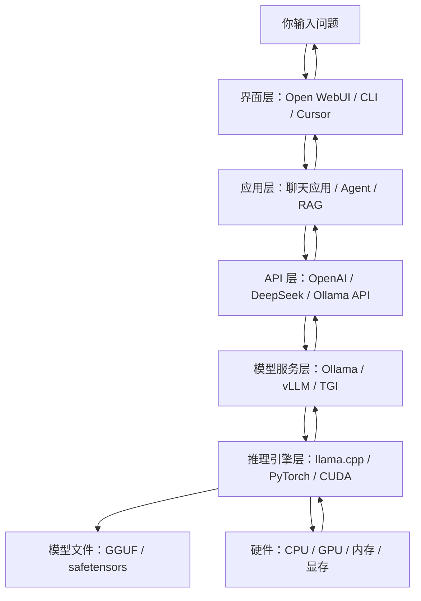

# 大模型自顶向下图解

目标：先看懂整体链路，再逐层深入。不要一开始就钻模型原理和底层源码。

## 1. 一张图看懂整体



一句话理解：

```text
你输入问题，客户端把问题发给模型服务，模型服务调用底层推理引擎，在 CPU/GPU 上生成答案，再把结果流式返回给你。
```

## 2. 用餐厅类比

```text
你                     = 顾客
Open WebUI / CLI       = 点餐界面
API                    = 点餐单
Ollama                 = 后厨管理系统
llama.cpp              = 真正炒菜的厨师和灶台
模型文件               = 菜谱和食材配方
CPU / GPU              = 厨房设备和火力
```

最关键的是：

```text
界面不负责推理。
Ollama 不是模型本身。
llama.cpp 才是更底层的计算核心。
模型文件只是数据，不能自己运行。
```

## 3. 每一层做什么

### 界面层

代表：

- `Open WebUI`
- `Cursor Chat`
- 你写的 `cli-chat/main.py`

作用：

- 接收输入
- 展示回答
- 保存聊天记录
- 调用后端 API

一句话：

```text
界面层负责“让人好用”，不负责真正推理。
```

### 应用层

代表：

- Python CLI
- RAG 应用
- Agent 应用
- 业务后端服务

作用：

- 组织 prompt
- 管理多轮上下文
- 调用工具或数据库
- 处理业务逻辑

一句话：

```text
应用层负责“把用户需求变成模型能理解的请求”。
```

### API 层

代表：

- OpenAI API
- DeepSeek API
- Ollama API
- 本地 proxy

常见请求结构：

```json
{
  "model": "deepseek-chat",
  "messages": [
    {"role": "system", "content": "你是一个助手"},
    {"role": "user", "content": "解释 KV Cache"}
  ],
  "stream": true
}
```

一句话：

```text
API 层负责“用统一协议调用模型”。
```

### 模型服务层

代表：

- `Ollama`
- `vLLM`
- `TGI`

作用：

- 加载模型
- 管理模型
- 暴露 HTTP API
- 处理请求和流式响应
- 调用底层推理引擎

一句话：

```text
模型服务层负责“把模型包装成一个可调用的服务”。
```

### 推理引擎层

代表：

- `llama.cpp`
- `PyTorch`
- `CUDA kernels`
- `TensorRT-LLM`

作用：

- 加载权重
- 执行矩阵计算
- 管理 KV Cache
- 逐 token 生成文本
- 使用 CPU/GPU 加速

一句话：

```text
推理引擎层负责“真正把模型跑起来”。
```

### 模型文件层

代表：

- `GGUF`
- `safetensors`
- `pytorch_model.bin`

作用：

- 保存模型权重
- 保存 tokenizer 相关配置
- 决定模型大小、能力和资源占用

一句话：

```text
模型文件是“参数数据”，不是可执行程序。
```

### 硬件层

代表：

- CPU
- GPU
- 内存
- 显存

作用：

- 执行实际计算
- 决定推理速度
- 限制可运行模型大小

一句话：

```text
硬件决定你能跑多大的模型，以及跑得有多快。
```

## 4. Ollama 和 llama.cpp 的关系

```text
Ollama     = 本地模型管理器 + 推理服务 + HTTP API
llama.cpp  = 底层 C/C++ 推理引擎
```

更直观地看：

```text
Open WebUI
  -> Ollama API
  -> Ollama 服务
  -> 底层推理引擎
  -> 模型文件
  -> CPU/GPU
```

从 C++ 后端视角看：

```text
llama.cpp ≈ 高性能 C++ 核心库
Ollama    ≈ 封装核心库的本地服务端
Open WebUI ≈ Web 管理界面
```

## 5. 云 API 和本地模型的区别

| 维度 | 云 API | 本地 Ollama |
| --- | --- | --- |
| 模型位置 | 供应商服务器 | 自己电脑 |
| 使用方式 | 调 HTTP API | 调本地 HTTP API |
| 成本 | 按 token 付费 | 消耗本机资源 |
| 隐私 | 数据发给供应商 | 数据留在本机 |
| 能力 | 通常更强 | 取决于本机模型 |
| 部署 | 简单 | 需要安装和配置 |

一句话：

```text
云 API 省心，本地模型可控。
```

## 6. 第一阶段应该学什么

按这个顺序：

```text
1. 先学 API：会调用模型
2. 再学 Ollama：会本地跑模型
3. 再学 Open WebUI：理解 UI 只是套壳
4. 再学 proxy：理解请求转发和流式透传
5. 最后看 llama.cpp：理解底层推理和性能优化
```

不要一开始就研究训练、论文和复杂数学。

当前最重要的是跑通这条链路：

```text
Python CLI
  -> DeepSeek / OpenAI 云 API
  -> Ollama 本地 API
  -> 本地 proxy
```

## 7. 你需要重点观察的指标

- 首 token 延迟：多久开始输出第一个字。
- 总耗时：完整回答生成多久。
- token/s：每秒生成多少 token。
- 上下文长度：历史记录变长后是否变慢。
- 内存/显存占用：模型运行需要多少资源。
- 流式响应：是否边生成边返回。
- 错误处理：超时、限流、鉴权失败时如何表现。

## 8. 最小心智模型

记住这几句话就够了：

```text
Open WebUI 是界面。
Python CLI 是你自己的客户端。
Ollama 是本地模型服务。
llama.cpp 是底层推理引擎。
模型文件是权重数据。
CPU/GPU 是实际算力。
```

最终目标：

```text
先会用，再会部署，再会代理，最后再研究怎么跑得快。
```
